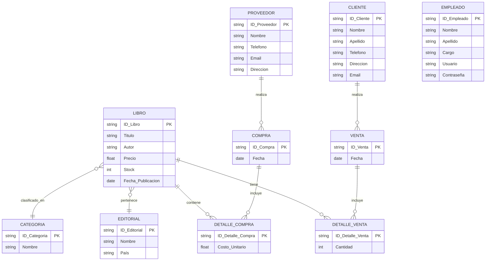

```mermaid
erDiagram
    LIBRO ||--o{ DETALLE_VENTA : tiene
    LIBRO ||--o{ DETALLE_COMPRA : contiene
    LIBRO }o--|| EDITORIAL : pertenece
    LIBRO }o--|| CATEGORIA : clasificado_en

    CLIENTE ||--o{ VENTA : realiza
    VENTA ||--o{ DETALLE_VENTA : incluye

    PROVEEDOR ||--o{ COMPRA : realiza
    COMPRA ||--o{ DETALLE_COMPRA : incluye

    EMPLEADO {
        string ID_Empleado PK
        string Nombre
        string Apellido
        string Cargo
        string Usuario
        string Contraseña
    }

    LIBRO {
        string ID_Libro PK
        string Titulo
        string Autor
        float Precio
        int Stock
        date Fecha_Publicacion
    }

    VENTA {
        string ID_Venta PK
        date Fecha
    }

    DETALLE_VENTA {
        string ID_Detalle_Venta PK
        int Cantidad
    }

    COMPRA {
        string ID_Compra PK
        date Fecha
    }

    DETALLE_COMPRA {
        string ID_Detalle_Compra PK
        float Costo_Unitario
    }

    CLIENTE {
        string ID_Cliente PK
        string Nombre
        string Apellido
        string Telefono
        string Direccion
        string Email
    }

    PROVEEDOR {
        string ID_Proveedor PK
        string Nombre
        string Telefono
        string Email
        string Direccion
    }

    EDITORIAL {
        string ID_Editorial PK
        string Nombre
        string País
    }

    CATEGORIA {
        string ID_Categoria PK
        string Nombre
    }
```
